<!--suppress HtmlDeprecatedAttribute -->

# Hytilities

## Users
### What is Hytilities?
Hytilities is a [Hypixel](https://hypixel.net) focused Forge 1.8.9 mod, adding tons of Quality of Life features that
you would want while on Hypixel, such as a player-advertisement blocker, an NPC hider, etc.

### How do I use Hytilities?
Hytilities is installed just like any other Forge mod.

If you do not know how to install a Forge mod, then we recommended looking up "How to install a Forge mod for Minecraft 1.8.9?".

## Developers
### How can I contribute to Hytilities?
You can contribute to Hytilities by following the instructions below. Basic knowledge of git is required.

#### Setup - IntelliJ
Press the green "Code" button.

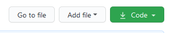

Depending on how your Git is set up/you want to clone, you will click on either HTTPS, SSH, or GitHub CLI,
then press the clipboard button beside the link.

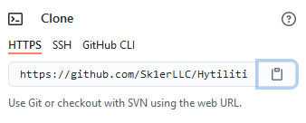 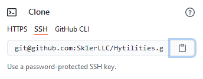 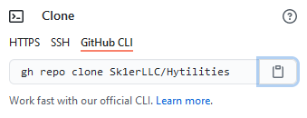

Open your preferred IDE, in this example we will be using [IntelliJ](https://www.jetbrains.com/idea/).
You can choose the "Community" tab if you do not already own the Ultimate version.

<!--- todo: include images here instead of a lot of text. i don't have ij 2020.2 currently, and the context menu on 2020.3 eap is incredibly different. -->
On IntelliJ's main menu, press the button that says "Check out from Version Control", click "GitHub", 
and paste the URL to the "Git Repository URL" text field. If you want to change the directory it will be cloned to, 
change the "Parent Directory" text field. Once you are done changing where you want it to be, click "Clone", 
then wait for it to finish. Once prompted with "You have checked out an IDEA project file: [file location]. Would you like to open it?", 
press the "Yes" button.

Once it is done cloning, click on the Gradle tab on the very right sidebar.

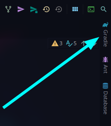

Once that is open, click the dropdown beside the Tasks folder.

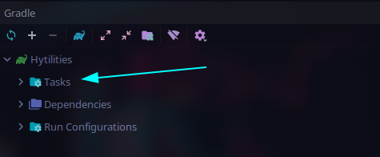

Then click the `forgegradle` directory dropdown.

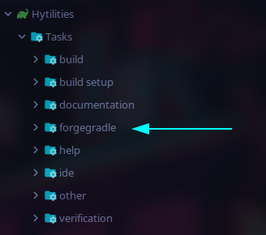

Then proceed to double-click the `setupDecompWorkspace` task. This may take a few minutes.

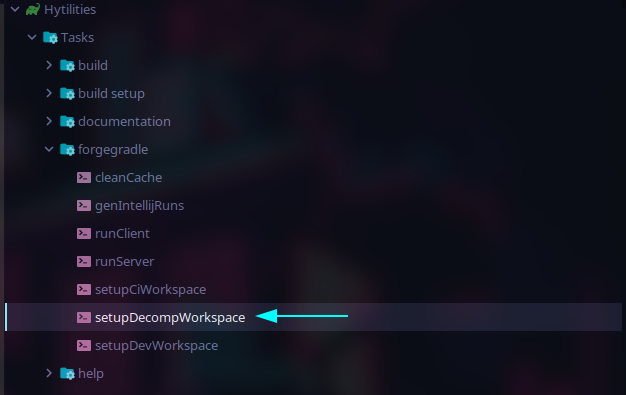

Once that is complete, you will want to click on this button in the top left of the Gradle tab.

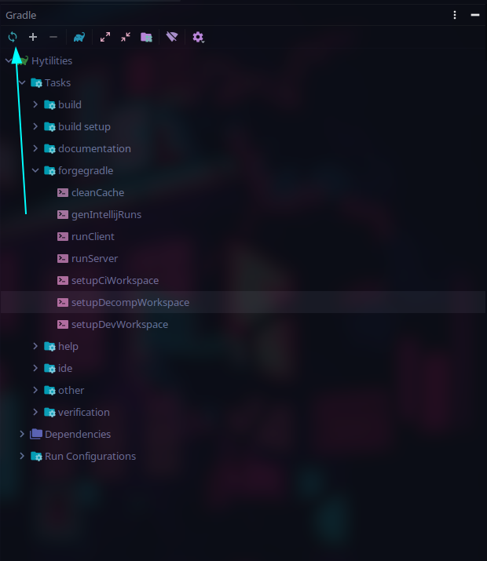

Once the project is done refreshing, you will want to run the `genIntellijRuns` task.

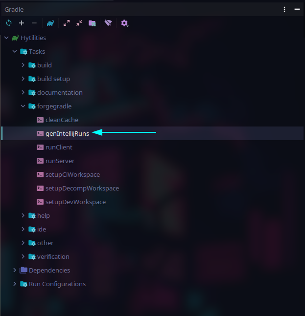

Once that task is complete, you can start Minecraft by clicking on this dropdown in the top right, usually saying Minecraft Client.

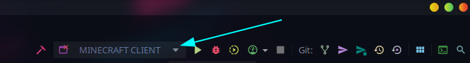

Click the `Edit Configurations...` button.

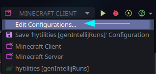

Click on `Minecraft Client`.

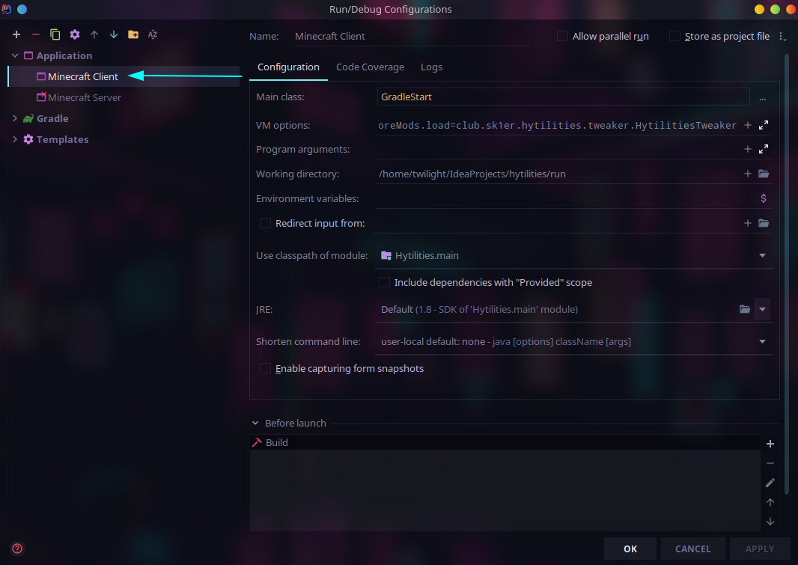

Ensure that the classpath is set to `Hytilities.main`. If it is not, select the drop down and set it.

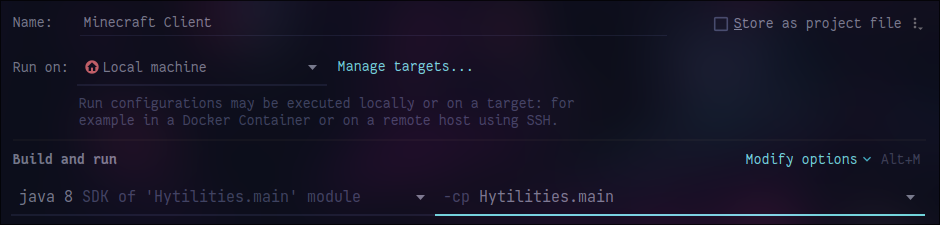

If you want to be able to play Multiplayer, you'll need to log in. To do this, append to the `Program Arguments` field `--username <email> --password <password>` where `<email>` is your email (or your account name if you have an unmigrated account) and `<password>` is your password. 

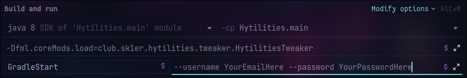

Apply and save your changes.

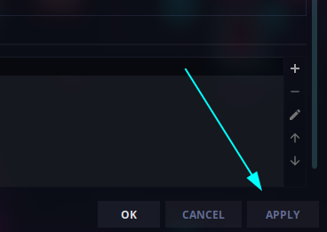

You should now be able to run Hytilities in the dev workspace.

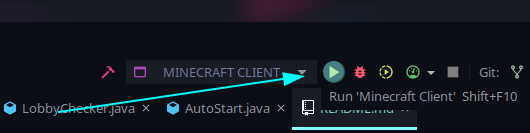

If you want to compile, then you must simply run `Tasks > build > build`.

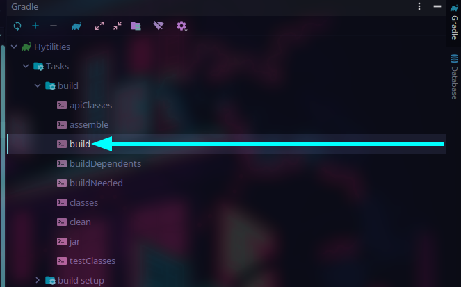

#### Setup - Terminal

*Note that while you can launch the game from the Terminal, you cannot login, so playing on Hypixel in the development environment is impossible.*

As with many GitHub projects, Hytilities is rather simple to set up in the Terminal. 

Click the green code button.

Depending on how your Git is set up/you want to clone, you will click on either HTTPS, SSH, or GitHub CLI,
then press the clipboard button beside the link.

  

Go to your terminal, and type `git clone `, paste in the URL you copied, and hit enter.

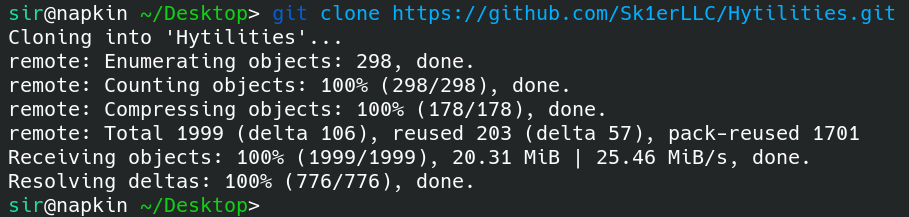

Enter the Hytilities directory. From here, what you do depends on your OS. This guide will use Linux, however the process is only slightly different on Windows. Instead of doing `./gradlew ...`, you do `gradlew ...`. If you are a Windows user, when copy and pasting commands from here, omit the `./`.

Type `./gradlew setupDecompWorkspace`. This may take several minutes. It should say `BUILD SUCCESSFUL` once finished.

Now, you can edit the files as you would any other project, such as with a Terminal editor like vim. To compile, run `./gradlew build`. They will be in the `build/libs` folder. To launch the game, run `./gradlew runClient`.
